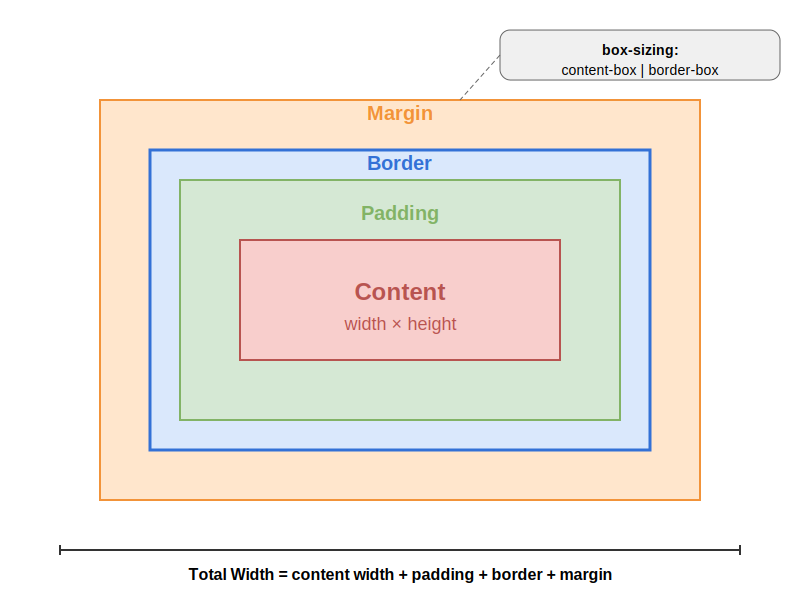

<!-- _class: title -->
# HTML & CSS Debugging
## Mentality & Workflow for Junior Engineers

---

# What We Are Going to Cover

* **The importance of debugging** in the development workflow
* **Mindset and approach** for effective debugging
* **Browser developer tools** for HTML/CSS inspection
* **Common layout issues** and their solutions
* **CSS specificity problems** and how to resolve them
* **Responsive design debugging** techniques
* **Cross-browser compatibility** issues
* **Practical debugging strategies** for junior engineers

---

# Why Debugging Matters

* Debugging is not separate from coding - it **is** coding
* 30-50% of development time is spent debugging (industry average)
* Essential skill that distinguishes junior from senior engineers
* Source of deep learning opportunities
* Critical for delivering polished, professional work

---

# The Debugging Mindset

* **Embrace problems** - they're learning opportunities, not failures
* **Be methodical** - random changes create more problems
* **Document as you go** - your future self will thank you
* **Seek patterns** - most bugs are variations of common issues
* **Take breaks** - fresh eyes spot what tired ones miss

---

# Debugging Workflow for Junior Engineers

1. **Reproduce consistently** - If you can't reproduce it, you can't fix it
2. **Isolate the issue** - Minimize code until only the problem remains
3. **Form a hypothesis** - "I think this happens because..."
4. **Test one change at a time** - Multiple changes = confusion
5. **Learn from each fix** - Document what you learned for next time

---

# Browser Developer Tools

| Elements Panel Essentials                                                        | Styles Panel                                                                      |
| -------------------------------------------------------------------------------- | --------------------------------------------------------------------------------- |
| • Inspect element structure<br> • View HTML hierarchy<br> • Find hidden elements | • View applied styles<br> • See inherited properties<br> •Check overridden styles |

---

# Browser Developer Tools



### Box Model

* Visualize margins/padding
* Debug spacing issues
* Understand layout flow

---

# Common Layout Issues

### Elements Not Appearing

```html
<!-- Check for: -->
<div style="display: none;">Hidden content</div>
<div style="visibility: hidden;">Invisible but taking space</div>
<div style="opacity: 0;">Transparent but clickable</div>
```

---

# Common Layout Issues

### Incorrect Spacing

```css
/* Common spacing issues */
.element {
    margin: 20px;        /* External spacing */
    padding: 15px;       /* Internal spacing */
    border: 1px solid;   /* Affects total size */
    box-sizing: content-box; /* vs border-box */
}
```

---

# CSS Specificity Problems

### Understanding Specificity

```css
/* Increasing specificity order */
p { }                    /* 0,0,0,1 */
.class { }               /* 0,0,1,0 */
#id { }                  /* 0,1,0,0 */
style="color: red"       /* 1,0,0,0 */
```

---

# CSS Specificity Problems

### Debugging Specificity

```css
/* Problem: Styles not applying */
.content p {
    color: blue;
}

/* Overridden by */
#main .sidebar .content p {
    color: red;  /* Wins due to higher specificity */
}
```

---

# Responsive Design Debugging

### Viewport Issues
```html
<!-- Check meta viewport tag -->
<meta name="viewport" content="width=device-width, initial-scale=1.0">
```
---
# Responsive Design Debugging
### Media Query Debugging
```css
@media screen and (max-width: 768px) {
    /* Debug with print statements */
    body::before {
        content: "Mobile view active";
        position: fixed;
        top: 0;
        background: red;
        color: white;
    }
}
```

---

# Responsive Design Debugging

### Flexbox/Grid Debugging
```css
/* Flexbox debugging */
.flex-container {
    display: flex;
    /* Common issues: */
    flex-direction: row;    /* Check direction */
    justify-content: space-between; /* Check alignment */
    align-items: center;    /* Check cross-axis alignment */
}
```

---

# Cross-Browser Issues

### Common Browser Differences
```css
/* Check for vendor prefixes */
.element {
    -webkit-transform: scale(1.1);
    -moz-transform: scale(1.1);
    -ms-transform: scale(1.1);
    transform: scale(1.1);
}
```

---

# Debugging Strategies for Junior Engineers

1. **Use temporary visual debugging**
   ```css
   * { outline: 1px solid red; }
   ```

2. **Add debug information to the page**
3. **Simplify until it works, then add complexity back**
4. **Compare working vs. non-working examples**
5. **Rubber duck debugging** - Explain the problem out loud

---

# Signs You're Growing as a Debugger

* You spend less time stuck on problems
* You make fewer "random" changes hoping they'll work
* You can explain *why* your fix worked
* You recognize patterns from previous debugging sessions
* You document issues for future reference
* Your estimates become more accurate

---

# Common Mental Traps

* **"It should just work"** - No, you need to understand why
* **"I'll just try this..."** - Without a hypothesis, you're guessing
* **"It's probably a browser bug"** - Rarely the first cause
* **"I'll fix it later"** - Small bugs become big problems
* **"I'm a bad developer because I have bugs"** - Everyone debugs!

---

# From Debugging to Prevention

* Consistent naming conventions
* Component-based thinking
* CSS methodologies (BEM, SMACSS)
* Regular code reviews
* Design system implementation
* Pre-commit linting
* Automated testing

---

# Debugging Checklist

## HTML Structure
* Valid HTML syntax
* Proper nesting
* Correct class/ID names

## CSS Validation
* Property spelling
* Valid values
* Units specified


---
# Debugging Checklist
## Layout
* Box model
* Element positioning
* Responsive breakpoints

## Visual Debugging
* Outlines/borders
* Background colors
* Element inspection

---

# Resources for Junior Engineers

* MDN Web Docs
* CSS-Tricks
* Can I Use
* Chrome/Firefox DevTools documentation
* W3C Validators for HTML and CSS

---

<!-- _class: highlight -->
# Questions & Discussion

* What's your most challenging CSS bug so far?
* Which debugging techniques have helped you most?
* What would make debugging easier in your workflow?